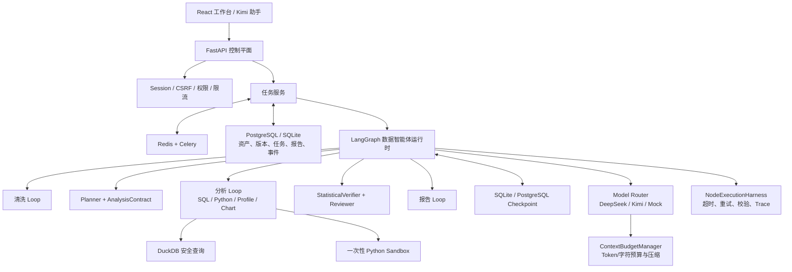

# DataMind 面试复习手册

> 适用范围：基于当前 DataMind 仓库（截至 2026-08-12）的项目介绍、架构复盘和技术面试准备。
> 建议先熟记“一分钟介绍”和“端到端链路”，再按面试岗位选择性复习难点与追问。

## 1. 一分钟项目介绍

DataMind 是一个面向结构化数据的、以证据为基础的 AI 数据分析系统。用户可以批量上传
CSV、Excel、JSON 或 TXT，系统会完成版本化清洗、多表关系识别和语义建模，再通过
LangGraph 编排 Planner、安全 SQL、沙箱 Python、统计验证、对抗审查和报告生成。

我在这个项目里重点解决的不是“让大模型写一段 SQL”，而是让整个分析过程可恢复、
可验证、可审计。为此，系统使用 PostgreSQL/SQLite 保存数据资产和任务状态，用 DuckDB
执行分析查询，用 Redis + Celery 承载异步任务，用 Checkpoint、租约、心跳、SSE 和
幂等提交保证任务重启后可恢复且不会重复产出。LLM 生成的 Python 代码在一次性、无网络
容器中执行，失败后最多进行两次带错误反馈的修复，最终仍失败则走确定性回退。

在可信度方面，Planner 会冻结 `AnalysisContract`，后续 `StatisticalVerifier` 检查指标、
维度、样本量、置信区间、Join 粒度和 evidence ID；报告只有通过验证后才能提交。项目还
提供有权限边界的 Kimi 助手和可信 Memory，但目前使用的是内部 MCP 风格 Runtime，标准
MCP stdio/Streamable HTTP Adapter 仍属于后续工作。

## 2. 三分钟展开版

### 2.1 项目解决什么问题

传统的数据分析链路通常需要人工完成导入、清洗、字段理解、SQL/Python 分析、图表制作和
报告整理。直接让 LLM 自动完成这些步骤，又容易出现四类问题：上下文超限、代码执行失败、
多表 Join 口径错误，以及报告中的数值缺少证据。

DataMind 的定位是把这些步骤组织成一个有边界的 Data Agent：LLM 负责语义理解、规划和
修复，确定性代码负责安全、统计验证、权限、持久化和最终提交。它不是一个无限自治的代码
Agent，也不是企业 BI 的替代品。

### 2.2 我的核心设计

1. **数据准备可回滚**：保留 raw records，每次清洗生成独立版本，通过质量门禁后才能激活。
2. **分析目标可验证**：Planner 不只输出自然语言计划，还冻结结构化 `AnalysisContract`。
3. **执行有边界**：分析 Loop 有工具数、决策数、Token、超时、去重和停止条件。
4. **代码执行隔离**：安全 SQL 使用 DuckDB；生成 Python 使用受控容器 Runner。
5. **结论必须有证据**：数值 finding 必须引用 evidence ID，并经过统计和对抗双重验证。
6. **任务可恢复**：数据库是状态事实来源，Celery 只负责投递，Checkpoint 支持节点级恢复。
7. **对话不能越权**：Kimi 的用户、资产范围和 Grant 由服务端注入，模型不能自行扩大权限。

### 2.3 最终结果

- 支持单表、多文件数据包、关系推荐、语义模型和安全多表分析。
- 默认运行有边界的清洗 Loop、分析 Loop 和报告 Loop，失败时可修复或确定性回退。
- 报告包含图表、验证问题、Analysis Contract、统计验证、字段/指标/Join/结论血缘。
- 当前仓库验证记录包括 395 个 Unit/Workflow/Integration 测试和 62 个桌面/移动端
  Playwright 用例；外部 claw-eval 六项任务平均分为 0.912，关键任务通过 pass^3。

## 3. 整体架构



### 3.1 需要准确表达的边界

- Planner、SQL、Python、Reviewer、Report 是有独立 Prompt 和模型路由的 LangGraph
  专职节点，共享一个 Workflow State，**不是分别部署的微服务**。
- LangGraph 是唯一的工作流调度器；`NodeExecutionHarness` 是节点执行中间层，负责超时、
  瞬时重试、Schema 校验、耗时和 Trace，不拥有第二套调度逻辑。
- `PostgreSQL/SQLite` 保存业务状态；`DuckDB` 是任务内分析引擎，不承担用户、任务和报告持久化。
- `app/mcp` 是内部 MCP 风格 Runtime 和模型/工具路由，**还不是标准外部 MCP Server**。

## 4. 端到端执行链路

### 4.1 数据导入与清洗

```text
拖拽/批量上传
  -> 文件流式落盘与格式解析
  -> 创建 Dataset；同批文件创建 Dataset Group
  -> 保存 raw records、Schema、Profile 和字段元数据
  -> 创建异步 Cleaning Job
  -> Cleaning Controller 选择 rules / LLM / hybrid
  -> 执行本地规则或一次性 Python Sandbox
  -> 检查行列保留、缺失率、重复率、类型稳定和异常膨胀
  -> 失败则修复、切换策略或确定性回退
  -> 通过后幂等创建并激活 Cleaning Version
  -> 保存 Diff、事件、租约、心跳和版本引用
```

关键点：清洗候选不直接覆盖当前数据；取消、失败或质量门禁不通过时，原活动版本保持不变。

### 4.2 多文件关系与语义层

```text
Dataset Group
  -> 本地规则：字段名、类型、唯一率、空值率、样本匹配率、基数
  -> 低置信候选才交给 LLM 做语义补充
  -> 后端重新校验 LLM 提议，拒绝不存在字段和高风险关系
  -> 保存关系图、字段来源、Join 风险和漂移状态
  -> 生成/发布版本化 Semantic Model
  -> 使用稳定 entity_id / field_id 和安全指标 DSL
```

LLM 只看压缩后的 Schema 和样本摘要，不读取完整 CSV；Embedding 只能辅助排序，不能创造
不存在的指标或把零匹配关系提升为自动关系。

### 4.3 自主分析主链路

```text
创建 Analysis Job
  -> Planner 读取问题、Profile、关系图、字段角色和语义模型
  -> 冻结 AnalysisContract：数据范围、指标、维度、时间、粒度、方法、预算、验收条件
  -> loop_bootstrap
  -> loop_decide：每轮只选择一个任务级白名单工具
  -> loop_execute：安全 SQL / 沙箱 Python / Profile / Chart
  -> loop_observe：压缩工具输出并登记 evidence
  -> loop_verify：判断 Contract 是否已覆盖
       -> 可修复：带明确 Contract gap 返回 loop_repair
       -> 已充分：进入 loop_finalize
       -> 超时/预算/Provider 失败：确定性 fallback
  -> integrate_insights
  -> format_charts
  -> statistical_verify
  -> adversarial_validate
       -> 高严重度证据缺口最多返回分析 Loop 一次
  -> report_decide -> execute -> verify -> repair/fallback
  -> report_commit：按 job_id 幂等提交一个报告
```

### 4.4 SQL 与 Python 如何执行

**SQL 路径**

- 单表或后端 Join 后的数据注册为 DuckDB 临时表 `dataset`。
- 发布语义模型时，只注册声明过的实体，并把指标 DSL 确定性编译为 SQL。
- 使用 `sqlglot` 校验 AST，只允许 SELECT/CTE、授权表字段和声明关系；禁止写操作、外部文件、
  系统表、未声明 Join、CROSS JOIN 和 NATURAL JOIN。

**Python 路径**

- 模型必须生成满足输出 Contract 的 `analyze(df)`。
- 代码进入独立 Python Runner 创建的一次性容器，默认无网络、非 root、只读根文件系统、
  限制内存/PID/输出并设置 wall timeout。
- 第一次失败：把代码和完整错误返回模型；第二次失败：带上前两次历史再次修复；第三次失败：
  停止请求模型，返回错误摘要并使用规则结果继续任务。
- 图表输出强制聚合或采样：直方图使用 bins，箱线图使用五数概括，records 设置硬上限。

### 4.5 验证与报告

`StatisticalVerifier` 是确定性代码，不依赖模型“自我评价”，主要检查：

- 用户要求的指标、维度、过滤和分析粒度是否真的被覆盖。
- 数值结论是否都有有效 evidence ID。
- 比较型结论是否包含样本量、效应量或 95% 置信区间。
- 观察性数据是否使用未经限定的因果措辞。
- 多表 Join 是否出现粒度污染、行数膨胀或重复汇总。

Reviewer 再从对抗视角检查口径、证据与表达。报告 Loop 最多修订两次；无法修复的 finding
不会伪装成成功结论，而是被排除并作为 validation issue 持久化。

### 4.6 异步任务、恢复和前端实时状态

- API 先创建数据库 Job，再投递 Celery；数据库是事实来源，Redis 不是。
- Worker 使用原子领取、租约、心跳和 `job_id` 幂等执行，重复投递不会重复生成报告。
- LangGraph 使用 `thread_id = job_id` 的持久 Checkpoint，Worker 重启后可从最后成功节点恢复。
- 用户通过 SSE 接收有序事件，断线后使用 `Last-Event-ID` 续传，轮询作为 fallback。
- 取消是协作式的：在节点边界、LLM 前后和 Sandbox 轮询点检查，不粗暴终止整个 Worker。

### 4.7 Kimi 助手链路

```text
用户消息/图片/数据文件
  -> 对话范围 + 权限 Grant 校验
  -> 检索当前用户的 Dataset / Job / Report / Memory
  -> Kimi 决定读取工具或发起 DataMind Workflow
  -> 工具参数由服务端注入 user_id、资产范围和能力
  -> 需要写入时执行风险策略、质量门禁、幂等和审计
  -> 新分析的 SSE 事件转发到对话
  -> 完成后读取压缩结果并流式生成答案
  -> 只允许引用本轮实际读取过的 evidence
```

问答模式只开放读取和计划预览；执行模式也不能绕过清洗质量、统计验证、SQL 安全和 Sandbox。

## 5. 项目中最重要的困难与解决方案

### 难点一：LLM 上下文不断超限

**现象**：早期把完整 Profile、样本、SQL rows、图表数据和历史 Trace 传给模型，出现
`400 context too large` 和 `413 request too large`。

**解决**：

- 引入统一 `ContextBudgetManager`，按清洗、Planner、SQL/Python、Reviewer、Report、Kimi
  设置不同 Token 上限，同时保留字符硬上限和 15% 安全余量。
- Prompt 改为 `PromptEnvelope + ContextSection`：系统规则、当前问题、Contract、错误和 evidence
  是必选区；样本、历史、图表、Trace 是可压缩区。
- 使用领域 reducer：Histogram 聚合为固定 bins，SQL/Profile/Python stats 做摘要，图表只传有限行，
  去掉重复工具结果和旧轮次。
- 必选 Contract 自身超限时明确失败，而不是截断后发送错误分析目标。

**面试亮点**：压缩不是简单截字符串，而是“统一预算 + 领域语义压缩 + Router 最终准入”。

### 难点二：生成 Python 不稳定，重试也可能重复失败

**现象**：模型代码因输出 Token 限制被截断，产生 `unterminated string literal`；即使代码成功，
逐行图表数据也可能触发 `Generated Python output exceeded the size limit`。

**解决**：

- 最多三次执行，前两次失败都把历史代码和错误完整反馈给模型。
- Prompt 强制短代码、少注释、受控 insights，并保留错误附近代码和函数签名。
- 从根源限制返回数据：Histogram 预分箱、Box Plot 五数概括、records 采样/限行。
- 最终仍失败时走规则 fallback，不让整个分析 Job 崩溃。
- 从宿主进程执行升级为一次性无网络容器，并由 Runner 强制 kill/remove。

### 难点三：模型把 ID 当指标，或选错业务字段

**现象**：`customer_id` 曾被生成 `SUM(CAST(... AS DOUBLE))`；“客户州”分析也可能误选
`seller_state`，模糊候选甚至污染统计验收条件。

**解决**：

- 引入字段角色 `metric/dimension/id/text/date/ignore`，ID/hash/code 默认不能成为聚合指标。
- 将 `required_dimensions` 与 `candidate_dimensions` 分离：只有用户明确提及或确认后的字段进入
  Analysis Contract，候选只用于 Planner 排序。
- 建立版本化语义模型、稳定字段 ID、指标 DSL、中英文别名与 BGE 联合排序。
- Planner 冻结 Contract，后续验证不能擅自扩大指标或维度。
- 没有可靠数值指标时回退 `COUNT(*)`，不随便选择第一个数值列。

### 难点四：多文件 Join 容易造成重复汇总和错误粒度

**现象**：订单、支付、商品、客户等表存在一对多和多对多关系，直接 Join 成宽表后，订单金额
可能被商品行重复放大；仅靠字段同名又无法覆盖非典型命名。

**解决**：

- 三层关系识别：本地规则打分、低置信时 LLM 语义补充、后端真实统计校验。
- 保存关系类型、左右表、样本匹配率、唯一率、基数和 Join 膨胀风险。
- Planner 原生携带关系图和分析粒度，对需要的事实表先聚合、去重或半连接。
- `StatisticalVerifier` 比较 Join 前后行数和 source-grain evidence；粒度不可信则拒绝提交结论。
- 所有冲突字段带来源前缀，报告保存字段来源和 Join 路径。

### 难点五：Agent Loop 会重复决策、耗时失控

**现象**：模型会交替执行相同的“检查上下文”和安全 SQL，工具虽然成功，但 Controller 不知道
证据何时充分，导致 Token 耗尽和重复后处理。

**解决**：

- 每轮计算确定性的 Contract coverage：已覆盖指标、维度、过滤、粒度和剩余 gap。
- 成功但证据不足时，下一轮收到明确 gap guidance，而不是泛化的“换个工具”。
- 使用 `canonical_action_hash`、SQL AST 规范化和 evidence hash 做全局去重。
- evidence 已覆盖 Contract 时立即收敛；统计预检通过后才进入 insights/charts。
- 限制工具数、决策数、Token 和 wall timeout，并为小型单表任务提供安全快速路径。

### 难点六：报告看起来合理，但数值可能没有依据

**现象**：LLM 能写出流畅总结，却可能引用错误维度、无来源数字，或者在统计审查失败后仍然
生成“完成报告”。

**解决**：

- 每条工具结果注册为 evidence，数值 finding 必须引用有效 evidence ID。
- 使用确定性 `StatisticalVerifier`，而不是让生成报告的模型自己给自己打分。
- 增加 Reviewer 对抗审查；高严重度失败只能有一次证据返工机会。
- 修复次数耗尽后任务标记审查失败，不能继续提交成功报告。
- Report commit 以 `job_id` 幂等，只产生一个主交付物，并保存公式、血缘和验证结果。

### 难点七：长任务切换页面或重启后状态丢失

**现象**：早期使用本地线程，前端离开分析页后状态重置；API/Worker 重启还可能丢任务或重复报告。

**解决**：

- 将 Job、事件、报告引用持久化；Redis 仅作为 Broker。
- Celery Worker 使用租约、心跳和补偿扫描，重复投递由 `job_id` 幂等吸收。
- LangGraph Checkpoint 保存可序列化小状态，大对象通过 artifact ID 重新加载。
- SSE 有序事件 + `Last-Event-ID` 续传，前端 Store 保持跨页面运行状态。
- 清洗、分析和 Kimi Run 使用统一的全局任务反馈。

### 难点八：保证 SQL/Python 能力，又不能开放任意代码执行

**现象**：过严 Sandbox 无法支持 Pandas 循环和 import；过松又可能访问宿主文件、网络或留下
无限循环容器。

**解决**：

- SQL 在 AST 层限定只读语句、表、字段和关系。
- Python 分为静态危险语法检查与容器级运行隔离，允许数据分析常用能力但不信任代码。
- Runner 使用非 root、只读根、无网络、tmpfs、capability drop、内存/PID/输出/wall timeout。
- 控制器在 `finally` 强制 kill/remove，生产环境禁止退回宿主子进程。

### 难点九：Kimi 既要方便，又不能越权

**现象**：让聊天助手调用 DataMind 全链路很方便，但模型可能扩大数据范围、误执行写操作或重复提交。

**解决**：

- 问答/执行双模式；问答模式根本不暴露写工具。
- `AssistantPermissionService` 独立于 Harness，做用户、对话范围、资产 Grant 和能力矩阵交集。
- user_id、Grant ID 和资产范围由服务端注入，模型无法覆盖。
- 写操作依次经过参数规范化、权限、风险策略、幂等、质量验证和审计。
- 删除为 30 天软删除；永久清理由系统任务负责，Kimi 无权调用。
- 对话创建使用 `Idempotency-Key + request_fingerprint + 唯一索引`，处理网络重试和多标签并发。

### 难点十：长期 Memory 容易过期、冲突或跨资产污染

**现象**：只保存最近十条消息会丢失长期偏好；直接保存模型推断又会引入错误记忆和跨数据集泄漏。

**解决**：

- 分离对话摘要、跨对话长期记忆、任务 Checkpoint，三者生命周期和职责不同。
- 记忆使用版本链；显式新指令替代旧版本，推断冲突进入 pending 等待确认。
- 按用户、数据集、数据包、报告做硬范围过滤，再用词法、BGE、近期性和 MMR 重排。
- 当前指令和已发布语义模型始终优先于 Memory。
- Memory v3 记录“有用/无关/错误”反馈，相关性和效用分开计算；低质记忆先进入可恢复 dormant，
  不静默删除，也不能授予工具权限。

### 难点十一：开发环境能跑，不代表能上线

**现象**：本地 SQLite + 线程执行无法处理多实例、任务恢复、会话安全、容器健康和生产迁移。

**解决**：

- 本地保留 SQLite/local executor；生产强制 PostgreSQL、Redis/Celery、Cookie Session 和 Runner。
- 使用 Alembic 管理版本，提供 SQLite 到 PostgreSQL 的 UUID 保留迁移。
- `/health/ready` 检查数据库、Redis、Worker 心跳、Runner、MCP Registry 和必要模型状态，失败返回 503。
- Compose 拆分 Caddy、Frontend、API、Worker、Beat、PostgreSQL、Redis、Runner 和 Sandbox。
- CI 分为 Unit/Workflow/Integration/Sandbox/E2E，并增加确定性发布 Benchmark 和真实 Provider canary。

### 难点十二：前端实时 Workflow 的真实性与可恢复性

**现象**：用 `setTimeout` 模拟节点进度虽然好看，但和真实任务脱节；SSE 正常结束还曾与 `onerror`
发生竞态，产生“已完成但提示断线”。

**解决**：

- 节点状态完全由后端有序事件驱动，动画只消费状态，不决定业务进度。
- 收到 terminal event 后先置位，再刷新最终 Job，后续 `onerror` 静默忽略。
- 切换页面后使用持久 Job ID、最后事件序号和 Store 恢复。
- 默认展示面向业务的简洁进度，内部节点、原始 payload 和调试 Trace 折叠显示。

## 6. 关键技术取舍

### 6.1 为什么 PostgreSQL/SQLite 与 DuckDB 同时存在

| 组件 | 职责 | 选择原因 |
| --- | --- | --- |
| SQLite | 本地开发持久化 | 零运维、单文件、便于 Demo 和测试 |
| PostgreSQL | 生产业务数据库 | 多并发、事务、约束、索引、租约、事件和 Alembic 迁移成熟 |
| DuckDB | 单次分析执行 | 对 Pandas/CSV 友好，OLAP 聚合快，临时表隔离，不需要额外分析服务 |

如果只用 PostgreSQL，分析临时表和业务表会互相影响，且本地体验更重；如果只用 DuckDB，用户、
会话、任务租约、事件和报告版本等高并发事务状态不合适；如果只用 SQLite，生产多 Worker 写入会
受限。因此采用“事务持久层 + 任务内分析引擎”的组合。

### 6.2 为什么使用 LangGraph，而不是手写状态机

- 分析不是单次链式调用，包含条件路由、返工、fallback、Checkpoint 和恢复。
- LangGraph 提供显式节点/边和持久线程状态，适合表达有边界 Loop。
- 自定义业务规则仍保留在领域模块，避免把所有逻辑耦合进图定义。
- 代价是 State 必须小型、可序列化，节点幂等和恢复语义需要额外设计。

### 6.3 为什么 LLM 和确定性规则混合

- LLM 擅长理解自然语言、非典型字段语义、生成分析方案和修复代码。
- 确定性代码更适合权限、安全 SQL、统计检验、质量门禁、幂等和最终提交。
- 纯规则覆盖不了开放业务问题；纯 LLM 又无法给出稳定安全保证。
- 原则是：**模型提议，系统约束；模型解释，证据裁决。**

### 6.4 Harness、Workflow 与 MCP Runtime 的区别

- **Workflow**：决定先执行哪个节点、何时循环和结束。
- **Harness**：包裹单个节点，提供超时、瞬时重试、Schema 校验、Trace 和上下文预算身份。
- **内部 MCP Runtime**：注册并调用受控模型/工具，统一能力和调用状态。
- 当前 `/api/v1/mcp/invoke` 是自定义 REST 边界，不是标准 MCP transport；后续可在内部 Runtime
  外增加 stdio/Streamable HTTP Adapter，而无需重写现有工具。

## 7. 代码导航

| 主题 | 主要文件/对象 |
| --- | --- |
| FastAPI 入口 | `app/main.py::create_app` |
| 分析图与 Runner | `app/analysis/workflow.py::AnalysisWorkflowRunner`、`build_analysis_workflow` |
| 分析 Contract | `app/analysis/analysis_contract.py`、`app/schemas/analysis.py::AnalysisContractResponse` |
| 统计验证 | `app/analysis/statistical_verifier.py::verify_statistical_analysis` |
| Agent 工具与去重 | `app/analysis/agent_loop.py::canonical_action_hash` |
| Python 隔离 | `app/analysis/python_sandbox.py::PythonExecutionPolicy`、`run_generated_python_analysis` |
| 语义模型/SQL | `app/semantic/service.py`、`app/semantic/dsl.py` |
| 上下文预算 | `app/harness/context.py::ContextBudgetManager`、`PromptEnvelope`、`ContextSection` |
| 节点 Harness | `app/harness/node.py::NodeExecutionHarness` |
| 内部 MCP Runtime | `app/mcp/bootstrap.py::build_mcp_runtime`、`app/mcp/contracts.py::MCPRuntime` |
| 分析任务 | `app/analysis/jobs.py::run_analysis_job` |
| Kimi Workflow/任务 | `app/assistant/workflow.py`、`app/assistant/jobs.py::run_assistant_run` |
| Kimi 权限 | `app/assistant/permissions.py::AssistantPermissionService` |
| Memory | `app/storage/assistant_memory_repository.py::AssistantMemoryRepository` |
| 业务持久化 | `app/storage/dataset_store.py::DatasetStoreRepository` |
| Kimi 持久化 | `app/storage/assistant_repository.py::AssistantRepository` |
| 生产部署 | `docker-compose.yml`、`Dockerfile`、`deploy/`、`docs/deployment.md` |
| 测试基准 | `tests/`、`app/evaluation/`、`benchmarks/` |

## 8. 高频面试追问与回答要点

### Q1：这和“ChatGPT + 上传 CSV”有什么区别？

后者主要是单次上下文分析，DataMind 把数据版本、关系、语义模型、任务、证据、血缘、权限和恢复
做成持久系统。模型不能直接决定安全和最终提交，分析结果还要经过 Contract 与统计验证。

### Q2：为什么不把整个 DataFrame 发给 LLM？

成本、上下文和隐私都不可控。系统本地计算 Profile、唯一率、空值率、Top-N、样本和聚合，再把
压缩后的证据发送给模型；SQL/Python 对真实数据执行，LLM 只负责规划和解释。

### Q3：如何防止幻觉数值？

工具执行产生 evidence ID；报告数值 finding 必须引用已登记 evidence；`StatisticalVerifier` 再检查
Contract coverage、数值一致性、样本量和 Join 粒度。没有证据就不能作为已验证结论提交。

### Q4：如何保证 Loop 不会无限运行？

工具次数、决策次数、Token、总时限和修复次数都是服务端预算；动作有 canonical hash 去重；
Contract coverage 达标立即停止；预算耗尽走 fallback，而不是继续请求模型。

### Q5：Python 三次修复和 Harness 重试会不会重复？

不会混为一类。Harness 只重试网络错误、429、5xx 和 timeout；Python 的三次尝试处理代码语法、
运行语义和输出 Contract 错误。两种重试的失败分类和预算相互独立。

### Q6：多表 Join 怎么保证金额不被放大？

保存基数和匹配率，Planner 明确事实粒度；执行时按需要预聚合/去重；Verifier 检查行数膨胀和
source-grain evidence。未通过时返工或拒绝结论，而不是只在报告里加一句风险提示。

### Q7：为什么任务状态放数据库，不放 Redis？

Redis 适合消息传递和临时协调，不适合作为唯一业务事实来源。数据库提供事务、约束、历史查询和
恢复；Redis 丢消息时补偿扫描可以根据 queued Job 重新投递。

### Q8：Checkpoint 和 Memory 有什么区别？

Checkpoint 保存一次任务的运行状态，目标是暂停/恢复；对话摘要压缩当前会话；长期 Memory 保存
跨对话偏好和业务定义。三者不能混用，Memory 也不能扩大权限或改变系统安全规则。

### Q9：Planner、SQL Agent、Python Agent 是不是独立 Agent？

逻辑上是专职 Agent/节点：有独立 Prompt、输入输出和模型路由；部署上不是独立服务，它们共享
LangGraph State，在同一 Worker Workflow 中执行。这样既保留职责分离，也避免微服务通信复杂度。

### Q10：当前 MCP 做到了什么？

实现了内部 Runtime、工具描述、Schema 校验、权限、超时重试和模型路由；尚未实现标准 MCP
stdio 或 Streamable HTTP transport，因此不能把自定义 `/mcp/invoke` 宣称为标准 MCP Server。

### Q11：系统失败时如何降级？

Provider 失败可以使用规则 Planner/统计摘要/报告模板；Python 失败使用规则分析；关系低置信只
提示而不自动应用；报告修复失败保留 validation issues。降级不会绕过权限和安全门禁。

### Q12：这个项目最值得讲的工程能力是什么？

不是 Prompt 数量，而是把不确定模型装进确定性边界：结构化 Contract、受控工具、统计验证、
幂等持久化、任务恢复、权限隔离和分层测试共同组成可靠性闭环。

### Q13：如果继续优化，你会先做什么？

1. 接入标准 MCP Adapter，但保持内部 Runtime 不变。
2. 在真实模型 Benchmark 累积五个有效批次后，把上下文预算从 shadow 切到 enforce。
3. 继续降低 Planner/Kimi 首 Token 延迟，并基于阶段耗时做自适应路由。
4. 加强原生关系图与预聚合规划，减少复杂事实表 Join 的粒度污染。
5. 增加企业 RBAC、SSO、组织级语义治理和审计控制台。

## 9. 面试中可以主动展示的量化结果

- 395 个 Unit/Workflow/Integration 测试通过，62 个桌面/移动端 Playwright 用例通过。
- Memory v3 Benchmark：`Precision@8=97.5%`、`Recall@8=97.5%`、有害记忆采用率 `0%`、
  500 条记忆本地检索 P95 `79.3ms`。
- 外部 claw-eval：六项任务平均分 `0.912`，关键任务通过 pass^3，安全维度均为 `1.00`。
- 数据库迁移已验证 SQLite/PostgreSQL 的 Alembic 升级、降级和重新升级到 `0014`。
- Docker 发布栈包含严格 readiness、Celery Worker、Python Runner 和生产 Smoke Workflow。

讲量化结果时要说明测试条件：自动化测试使用 Mock Provider；真实 Provider 基准与确定性发布门禁
分开，避免把 Mock 成功率描述成线上模型质量。

## 10. 面试表达建议

### 推荐表达顺序

1. 先讲业务问题：上传数据后自动得到可信报告。
2. 再讲最难的问题：不是生成，而是口径、证据、安全和恢复。
3. 用一条端到端链路解释系统。
4. 选两个最有代表性的事故讲“现象 -> 根因 -> 修复 -> 验证”。
5. 最后主动说明限制和下一步，体现工程判断而不是过度包装。

### 最推荐的两个事故故事

**故事 A：Python 代码连续失败**

模型三次都在相同字符截断，最初看起来像语法能力问题；通过对比代码发现实际是输出 Token 上限。
修复后又遇到执行输出过大，根因是把几万行图表原始点转成 records。最终同时从代码生成预算和
结果数据结构两端治理：错误反馈修复、短代码 Contract、直方图分箱、箱线图摘要、硬性输出限制和
容器回退。这个故事能体现故障分类，而不是盲目增加重试。

**故事 B：客户州被分析成卖家州**

报告从语言上完全合理，但业务维度选错；同时多表 Join 存在粒度风险。修复不是改一个中文关键词，
而是把 required 与 candidate 维度分层，冻结 AnalysisContract，引入字段来源和稳定语义 ID，再由
StatisticalVerifier 检查 SQL 的 GROUP BY 与 Join 粒度。这个故事能体现从局部 Bug 上升为通用机制。

### 避免过度表述

- 不要说“完全杜绝幻觉”，应说“通过证据和确定性验证降低并阻断无依据结论的提交”。
- 不要说“实现了标准 MCP”，应说“实现内部 MCP 风格 Runtime，标准 transport 尚未接入”。
- 不要把 LangGraph 节点说成独立微服务。
- 不要说“Python Sandbox 绝对安全”，应说明是容器级本地/服务安全边界，不等于形式化安全证明。
- 不要把 Kimi/DeepSeek 的单次效果当作稳定 SLA，应引用分层 Benchmark 和校准策略。

## 11. 最后速记卡

```text
一句话：从原始数据到有证据、可恢复、可审计报告的 Data Agent。

三层存储：
PostgreSQL/SQLite = 业务状态
DuckDB = 分析执行
Redis = 任务传递/限流，不是事实来源

三类 Loop：
清洗 Loop -> 分析 Loop -> 报告 Loop

可信闭环：
AnalysisContract -> evidence -> StatisticalVerifier -> Reviewer -> 幂等 Report Commit

安全闭环：
服务端范围/权限 -> 安全 SQL AST -> 一次性 Python Sandbox -> 质量门禁

可靠性闭环：
Job 持久化 -> Celery -> 租约/心跳 -> Checkpoint -> SSE -> 幂等提交

LLM 原则：
模型提议，系统约束；模型解释，证据裁决。

当前 MCP：
内部 MCP 风格 Runtime 已实现；标准 stdio/Streamable HTTP 尚未实现。
```
