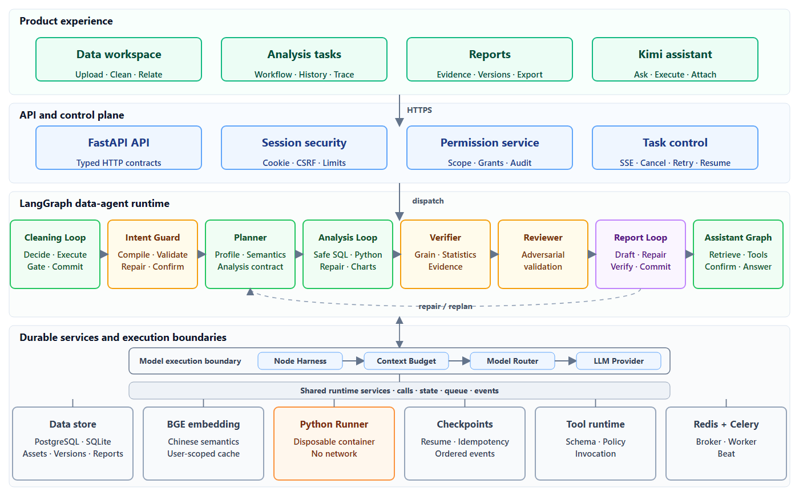
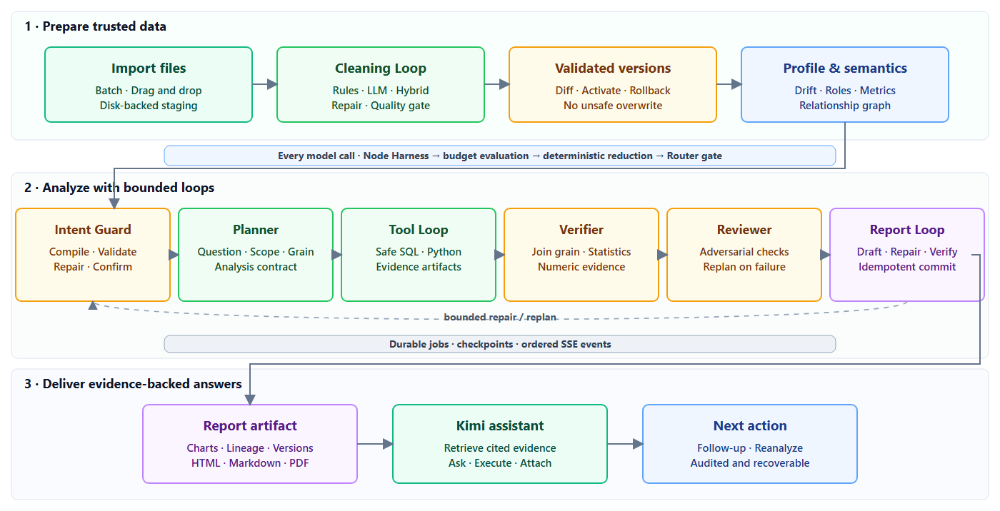

# DataMind

<div align="center">
  <strong>Evidence-grounded AI data analysis, from raw files to auditable reports.</strong>
  <br />
  <br />
  <a href="README.md">English</a> | <a href="README.zh-CN.md">简体中文</a>
  <br />
  <br />
  
  
  
  
  
</div>

DataMind is a local-first data agent for importing structured files, cleaning and
profiling data, understanding multi-table relationships, answering business
questions with SQL and Python, and producing evidence-backed reports. LangGraph
coordinates bounded cleaning, analysis, verification, and report loops; Kimi adds
a permission-aware conversational workspace over the same DataMind assets.

> DataMind is under active development. It is designed as an auditable analytics
> service, not as a replacement for enterprise BI governance or a general-purpose
> code execution platform.

## Why DataMind

| Capability | What it provides |
| --- | --- |
| Data preparation | Drag-and-drop CSV, XLSX, JSON, and TXT imports; multi-file packages; cleaning versions, diffs, rollback, and drift detection |
| Semantic understanding | Column roles, bilingual semantic ranking, versioned metric DSL, relationship graph, Join cardinality and grain checks |
| Autonomous analysis | Guarded intent compilation, Planner, safe SQL, sandboxed Python, bounded repair loops, deterministic fallback, and resumable jobs |
| Trustworthy output | Statistical verification, evidence IDs, lineage, adversarial review, report repair, and auditable commit |
| Kimi workspace | User-scoped conversations, structured summaries, trustworthy versioned memory, read-only analysis experience, image/data attachments, grants, audit, and recycle bin |
| Production runtime | PostgreSQL, Redis, Celery, checkpoint recovery, SSE events, Cookie sessions, CSRF, rate limits, and Docker sandboxing |

## Architecture

Intent Compiler, Planner, SQL, Python, Reviewer, and Report are specialized LangGraph nodes with separate prompts and model
routing. They share one durable workflow state; they are not independently
deployed microservices.

[](docs/assets/datamind-architecture-en.svg)

<p align="center"><sub>Product experience → API and control plane → LangGraph agent runtime → governed model execution and durable services. Select the image to open the vector version.</sub></p>

Every model call crosses the Node Harness, shared context budget, Model Router,
and provider boundary. The separate runtime-services boundary is bidirectional:
LangGraph reads and writes data and checkpoints, invokes BGE, the Python Runner
and governed tools, and exchanges jobs and events through Redis/Celery. Solid
horizontal arrows show workflow control; the dashed path shows bounded repair or
replanning.

## End-to-End Workflow

[](docs/assets/datamind-workflow-en.svg)

<p align="center"><sub>Trusted data preparation → governed model context → bounded analysis and verification → evidence-backed delivery and follow-up. Select the image to open the vector version.</sub></p>

The loops are bounded by tool, decision, token, retry, and wall-clock budgets.
Failed generated Python code is returned to the model for at most two repairs;
validated deterministic fallback keeps the job controlled when model execution
cannot be trusted.

Before planning, the Intent Compiler turns the raw question into a declarative
specification with source spans, polarity, field bindings, and relationship
constraints. A deterministic Intent Guard validates negation, asset scope, and
field existence. After planning, the Contract Guard checks that metrics,
dimensions, filters, joins, and grain still satisfy the approved intent. Guard
feedback allows at most two repairs; unresolved requests require confirmation or
stop before any analysis tool runs.

## Core Features

- Batch and drag-and-drop upload for CSV, XLSX, JSON, and TXT, including
  single-Sheet selection and disk-backed staging for large files.
- Dataset packages with rule-based and LLM-assisted relationship suggestions,
  sample match rates, cardinality warnings, and automatic validated plans.
- Versioned cleaning runs, field metadata, preview diffs, activation, rollback,
  schema drift, data drift, and stale-asset propagation.
- Versioned semantic models with stable field/entity IDs, metric DSL, Chinese
  semantic matching through BAAI/bge-small-zh-v1.5, validation, and publishing.
- LLM intent compilation with deterministic Intent and Contract Guards preserves
  complex negation, strict asset scope, required fields, and forbidden relations
  while preventing hallucinated fields from entering execution.
- Safe DuckDB SQL constrained to approved datasets, fields, and relationship paths.
- Generated Python execution in a controlled subprocess or one-shot container,
  with timeout, output limits, chart compaction, repair attempts, and fallback.
- Statistical verification for requested metrics/dimensions, Join grain,
  evidence coverage, comparison support, confidence intervals, and causal wording.
- Structured web reports with charts, brief/standard/detailed views, versioning,
  HTML/Markdown export, and browser-print PDF.
- Persistent analysis, cleaning, and Assistant jobs with cancellation, retry,
  checkpoint recovery, ordered events, and page-switch continuity.

## Quick Start

### Prerequisites

- Python 3.12
- Node.js 24 and npm
- Docker Desktop or Docker Engine with Compose for the production profile

### Local development

```bash
python -m venv .venv
# Windows: .venv\Scripts\activate
# Linux/macOS: source .venv/bin/activate

python -m pip install -e ".[dev]"
# Windows: copy .env.example .env
# Linux/macOS: cp .env.example .env

alembic upgrade head
python -m uvicorn app.main:create_app --factory --reload --host 127.0.0.1 --port 8010
```

In another terminal:

```bash
npm --prefix frontend/react ci
npm --prefix frontend/react run dev
```

Open:

- React workspace: <http://127.0.0.1:5173>
- Swagger UI: <http://127.0.0.1:8010/docs>
- Readiness: <http://127.0.0.1:8010/api/v1/health/ready>

Without provider keys, set `DATAMIND_LLM_PROVIDER=mock` for deterministic local
development. Never commit `.env` or production credentials.

### Production-like Docker deployment

```bash
# Windows: copy .env.production.example .env.production
# Linux/macOS: cp .env.production.example .env.production

# Replace every change-me value and configure model keys first.
docker compose --env-file .env.production config --quiet
docker compose --env-file .env.production build --pull
docker compose --env-file .env.production up -d
```

The Compose stack includes Caddy, Nginx/React, FastAPI, PostgreSQL, Redis, Celery
Worker and Beat, the controlled Python Runner, and the no-network sandbox image.
See the [Deployment Guide](docs/deployment.md) for DNS, HTTPS, upgrades, backup,
health checks, and SQLite-to-PostgreSQL migration.

## Configuration

Copy `.env.example` for local development or `.env.production.example` for
Compose. The most important settings are:

| Variable | Purpose |
| --- | --- |
| `DATAMIND_DATABASE_URL` | SQLite locally or PostgreSQL in production |
| `DATAMIND_REDIS_URL` | Celery broker and rate-limit storage |
| `DATAMIND_EXECUTION_BACKEND` | `local` or `celery` |
| `DATAMIND_AUTH_MODE` | `legacy` locally or `session` in production |
| `DATAMIND_DEEPSEEK_API_KEY` | Planner, SQL, Python, and analysis Loop provider |
| `DATAMIND_KIMI_API_KEY` | Reviewer, report, multimodal, and Assistant provider |
| `DATAMIND_PYTHON_RUNNER_URL` | Controlled container runner endpoint |
| `DATAMIND_AGENT_LOOP_DEFAULT_MODE` | Default `loop`; `legacy` is compatibility mode |
| `DATAMIND_INTENT_COMPILER_ENABLED` | Enables structured intent compilation and review |
| `DATAMIND_INTENT_COMPILER_MODE` | `shadow` observes; `enforce` executes only guarded compiled intent |
| `DATAMIND_INTENT_COMPILER_PROVIDER` | Provider used by the intent compiler |
| `DATAMIND_INTENT_COMPILER_MAX_REPAIRS` | Maximum intent repairs after Guard feedback |
| `DATAMIND_CONTRACT_GUARD_ENABLED` | Validates the AnalysisContract before tool execution |
| `DATAMIND_CONTEXT_BUDGET_MODE` | Unified context-budget mode: `shadow` or `enforce` |
| `DATAMIND_LLM_CONTEXT_WINDOW_TOKENS` | Conservative provider context-window token budget |
| `DATAMIND_CONTEXT_SAFETY_RATIO` | Reserve for output and token-estimation variance |
| `DATAMIND_SEMANTIC_EMBEDDING_ENABLED` | Enables local semantic embedding ranking |
| `DATAMIND_ASSISTANT_MEMORY_ENABLED` | Enables Kimi conversation summaries and long-term memory |
| `DATAMIND_ASSISTANT_MEMORY_RELEVANCE_THRESHOLD` | Minimum combined relevance for ordinary recalled memory |
| `DATAMIND_ASSISTANT_MEMORY_EXPERIENCE_ENABLED` | Enables validated read-only route experience for Planner |
| `DATAMIND_ASSISTANT_MEMORY_MODEL_EXTRACTION_ENABLED` | Enables post-answer, source-verified Kimi memory extraction |
| `DATAMIND_ASSISTANT_MEMORY_AUTO_DORMANCY_ENABLED` | Enables automatic low-utility dormancy after calibration; defaults to `false` |
| `DATAMIND_ASSISTANT_MEMORY_DORMANCY_THRESHOLD` | Utility threshold used by the calibrated dormancy policy |

Agent-level provider routing is configured independently. Kimi and DeepSeek are
defaults, not hard requirements; tests use the mock provider.

Every cleaning, analysis, review, report, and Kimi model call passes through the
shared context budget manager. System policy, the current question, analysis
contract, errors, and evidence are retained first; profiles, samples, SQL/Python
results, charts, history, and tool output use deterministic domain reducers. The
default `shadow` mode records proposed compression without changing provider input;
`enforce` sends the bounded prompt. Router admission uses both conservative token
estimation and the existing character hard limit.

## Kimi Data Assistant

Kimi can retrieve the current user's datasets, completed analysis results, and
reports. Ask mode is read-only. Execute mode requires an asset grant and can run
bounded cleaning, relationship, analysis, report, and semantic-model operations.
Server-side scope checks inject user identity; the model cannot expand its own
permissions. Mutations are idempotent and audited, while soft deletion always
requires confirmation and remains recoverable for 30 days.
Conversation creation also accepts `Idempotency-Key`: retries, remounts, and
concurrent tabs resolve to one user-scoped conversation, while a new explicit
creation intent still creates a new conversation.

Attachments support JPEG, PNG, WebP, CSV, XLSX, JSON, and TXT. Large data files are
streamed to protected staging storage and parsed one file at a time. Final answers
stream real provider tokens and may cite only assets actually read during the run.

Kimi memory has three explicit layers: sourced structured summaries compress older
messages; versioned semantic memory carries approved preferences, terminology,
metric definitions, and business context; task checkpoints only resume one run.
Explicit conflicting instructions create a new active version and supersede the old
one, while inferred conflicts require confirmation. A separate episodic store keeps
only statistically validated analysis experience as read-only Planner evidence; it
never executes tools or bypasses fresh planning. Recalled memory is relevance gated,
MMR-ranked, user/asset isolated, auditable per run, and can be disabled without
deleting stored memory or current-conversation summaries.

Memory v3 closes the quality loop. Durable statements are normalized as typed
`entity + predicate + value` facts, and complex cross-sentence definitions are
extracted after the answer is committed with source-message verification. Users can
mark each recalled memory as helpful, irrelevant, or wrong. Relevance and utility
are scored separately; suppressed candidates keep an auditable reason. Low-quality
memory enters a reversible dormant state only after sufficient feedback. Automatic
dormancy is disabled by default during the five-batch calibration period.

## MCP Status

`app/mcp` currently provides an internal MCP-style runtime for tool registration,
schema validation, retries, and model routing. The authenticated
`/api/v1/mcp/invoke` endpoint is a project-specific REST boundary, **not a standard
external MCP Server transport**. Standard MCP `stdio` or Streamable HTTP support is
planned as a separate adapter; the internal tools can be reused behind it.

## Tests and Benchmarks

```bash
# Fast unit suite; this is the default pytest layer.
python -m pytest

# Real LangGraph with mocked model and Python execution boundaries.
python -m pytest -o addopts="" -m workflow

# FastAPI, temporary SQLite, DuckDB, and mocked infrastructure.
python -m pytest -o addopts="" -m integration

# Explicit subprocess, timeout, and isolation checks.
python -m pytest -o addopts="" -m sandbox

# Project benchmark tests and deterministic release gate.
python -m pytest -o addopts="" -m benchmark
python -m app.evaluation.cli run --suite release
python -m app.evaluation.cli run --suite memory

npm --prefix frontend/react run build
npm --prefix frontend/react run test:e2e
ruff check .
mypy app tests
```

Additional benchmark suites cover real providers, performance, resilience,
frontend event latency, and claw-eval task adapters. Benchmark history stores
aggregate latency, token, repair, and fallback metrics without prompts, messages,
dataset rows, or report bodies.

## Project Layout

```text
app/
  analysis/          Planner, loops, SQL/Python, verification and lineage
  assistant/         Kimi workflow, permissions, evidence and tools
  data_reliability/  Profile snapshots and drift detection
  semantic/          Semantic models, metric DSL, ranking and relationship graph
  api/               FastAPI routes and authentication boundary
  storage/           SQLite/PostgreSQL repositories and migration helpers
  mcp/               Internal tool runtime and model router
  harness/           Node timeout, retry, validation and trace boundary
  evaluation/        Benchmark harness, corpus and release gates
  python_runner/      Controlled container runner service
frontend/react/       React, Vite, Tailwind and Playwright
migrations/           Alembic migrations
benchmarks/           Deterministic and claw-eval suites
deploy/               Caddy and evaluation deployment assets
docs/                 Development and deployment guides
tests/                Unit, workflow, integration, sandbox and benchmark tests
```

## Security Boundaries

- Production uses HttpOnly Cookie sessions, CSRF and Origin checks, rate limits,
  user-scoped repositories, and capability grants.
- Analysis SQL is SELECT-only and constrained by the approved semantic scope.
- Generated Python runs without network access in a disposable restricted container.
- LLM output, report evidence, uploaded text, and image OCR are treated as
  untrusted input and cannot override permissions or immutable safety policy.
- Secrets belong in environment variables or a deployment secret manager, never Git.

## Current Limitations

- No enterprise RBAC, SSO, or organization-wide semantic governance.
- No arbitrary user-authored multi-table SQL or unrestricted code execution.
- No standard external MCP Server transport yet.
- AutoML and model training are outside the current scope.

## Documentation

- [Product Requirements](prd.md)
- [Development Guide](docs/development.md)
- [Deployment Guide](docs/deployment.md)
- [Internal MCP Tool Extension Guide](docs/mcp_tool_extension.md)
- [Benchmark Guide](benchmarks/README.md)
- [Contributing](CONTRIBUTING.md)
- [Security Policy](SECURITY.md)

## License

DataMind is currently proprietary and all rights are reserved. See [LICENSE](LICENSE).
