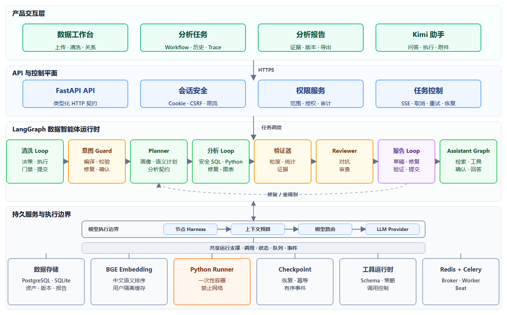
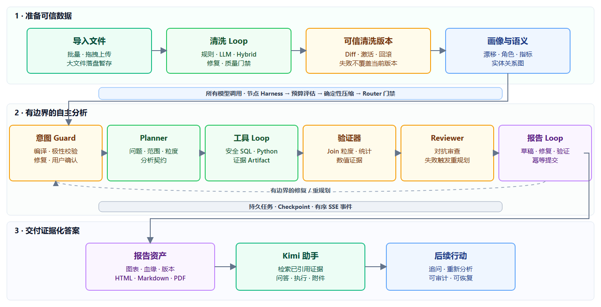

# DataMind

<div align="center">
  <strong>从原始数据文件到可审计报告，以证据为基础的 AI 数据分析系统。</strong>
  <br />
  <br />
  <a href="README.md">English</a> | <a href="README.zh-CN.md">简体中文</a>
  <br />
  <br />
  
  
  
  
  
</div>

DataMind 是一个本地优先的数据智能体系统，可导入结构化文件、完成数据清洗与画像、
理解多表关系、通过 SQL 和 Python 回答业务问题，并生成具有证据和血缘的分析报告。
LangGraph 负责组织有边界的清洗、分析、验证和报告 Loop；Kimi 则基于同一批
DataMind 数据资产提供受权限约束的对话式工作台。

> DataMind 正在持续开发。它的目标是成为可恢复、可验证、可审计的数据分析服务，
> 而不是替代企业级 BI 治理，也不是通用代码执行平台。

## 为什么选择 DataMind

| 能力 | 提供的价值 |
| --- | --- |
| 数据准备 | 拖拽导入 CSV、XLSX、JSON、TXT；多文件数据包；清洗版本、Diff、回滚和漂移检测 |
| 语义理解 | 字段角色、中英文语义排序、版本化指标 DSL、关系图、Join 基数与数据粒度检查 |
| 自主分析 | 受审查的意图编译、Planner、安全 SQL、沙箱 Python、有边界修复 Loop、规则回退和任务恢复 |
| 可信交付 | 统计验证、evidence ID、血缘、对抗审查、报告修复和幂等提交 |
| Kimi 工作台 | 用户隔离对话、结构化摘要、可信版本记忆、只读分析经验、图片与数据附件、授权、审计和回收站 |
| 生产运行 | PostgreSQL、Redis、Celery、Checkpoint、SSE、Cookie 会话、CSRF、限流和容器沙箱 |

## 系统架构

Intent Compiler、Planner、SQL、Python、Reviewer 和 Report 是具有独立 Prompt 与模型路由的
LangGraph 专职节点。它们共享一个可持久化的 Workflow State，并不是分别部署的微服务。

[](docs/assets/datamind-architecture-zh.svg)

<p align="center"><sub>产品交互层 → API 与控制平面 → LangGraph 数据智能体运行时 → 受控模型执行与持久服务。点击图片可打开矢量版本。</sub></p>

每次模型调用都会经过节点 Harness、统一上下文预算、模型路由和 Provider 边界。
独立的运行支撑边界保持双向关系：LangGraph 读写数据与 Checkpoint，调用 BGE、
Python Runner 和受控工具，并通过 Redis/Celery 交换任务与事件。横向实线表示工作流
控制，虚线回路表示有边界的修复或重规划。

## 端到端流程

[](docs/assets/datamind-workflow-zh.svg)

<p align="center"><sub>可信数据准备 → 受控模型上下文 → 有边界的自主分析与验证 → 证据化交付与后续行动。点击图片可打开矢量版本。</sub></p>

所有 Loop 都受工具次数、决策次数、Token、重试和总时限约束。LLM 生成的
Python 代码执行失败后，错误会被反馈给模型，最多进行两次修复；无法获得可信结果时，
系统使用经过验证的确定性回退，而不是无限重试。

分析前，Intent Compiler 将原始问题编译为带原文位置、极性、字段绑定和关系约束的
声明式意图。确定性 Intent Guard 校验否定语义、资产范围和字段真实性；Planner 产出
AnalysisContract 后，Contract Guard 再验证指标、维度、过滤、Join 与粒度是否忠实。
Guard 可把具体错误反馈给模型修复，最多两次；仍不可靠时要求确认或拒绝执行工具。

## 核心功能

- 批量拖拽导入 CSV、XLSX、JSON 和 TXT，支持 Excel Sheet 选择以及大文件落盘暂存。
- 多文件自动组成数据包，使用规则与 LLM 推荐关系，并展示样本匹配率、基数和 Join 风险。
- 清洗版本、字段元数据、Diff 预览、激活、回滚、Schema/Data Drift 和过期资产传播。
- 版本化语义模型、稳定字段与实体 ID、指标 DSL、BAAI/bge-small-zh-v1.5
  中文语义匹配、校验和发布。
- LLM 意图编译配合确定性 Intent/Contract Guard，保留复杂否定、严格资产范围、
  必选指标/维度和禁止关系，并阻止模型幻觉字段进入执行链。
- DuckDB 安全 SQL，只允许访问授权数据集、字段和已声明的关系路径。
- Python 代码在受控子进程或一次性容器执行，具备超时、输出限制、图表压缩、修复和回退。
- 验证用户要求的指标/维度、Join 数据粒度、证据覆盖、比较型结论、置信区间和因果措辞。
- 使用 SQL AST 区分全量结果、最高/最低 N 个分组、有限分组和有限行；报告提交前会核对
  过滤前后样本量、Join 基数与图表说明，局部小计不会被表述为总体结论。
- 结构化 Web 报告、图表、简洁/标准/详细模板、版本历史、HTML/Markdown 和浏览器打印 PDF。
- 分析、清洗和 Assistant 任务支持取消、重试、Checkpoint 恢复、有序事件和跨页面持续运行。

## 快速开始

### 环境要求

- Python 3.12
- Node.js 24 与 npm
- 生产模式需要 Docker Desktop 或 Docker Engine + Compose

### 本地开发

```bash
python -m venv .venv
# Windows: .venv\Scripts\activate
# Linux/macOS: source .venv/bin/activate

python -m pip install -e ".[dev]"
# Windows: copy .env.example .env
# Linux/macOS: cp .env.example .env

alembic upgrade head
python -m uvicorn app.main:create_app --factory --reload --host 127.0.0.1 --port 8010
```

另开一个终端启动前端：

```bash
npm --prefix frontend/react ci
npm --prefix frontend/react run dev
```

访问地址：

- React 工作台：<http://127.0.0.1:5173>
- Swagger UI：<http://127.0.0.1:8010/docs>
- Readiness：<http://127.0.0.1:8010/api/v1/health/ready>

没有模型 Key 时，可设置 `DATAMIND_LLM_PROVIDER=mock` 使用确定性 Mock 进行本地开发。
不要把 `.env` 或生产凭据提交到 Git。

### Docker 生产化部署

```bash
# Windows: copy .env.production.example .env.production
# Linux/macOS: cp .env.production.example .env.production

# 先替换所有 change-me 值并配置模型 Key。
docker compose --env-file .env.production config --quiet
docker compose --env-file .env.production build --pull
docker compose --env-file .env.production up -d
```

Compose 包含 Caddy、Nginx/React、FastAPI、PostgreSQL、Redis、Celery Worker、
Celery Beat、受控 Python Runner 和无网络 Sandbox 镜像。DNS、HTTPS、升级、备份、
健康检查和 SQLite 迁移请查看[部署指南](docs/deployment.md)。

## 关键配置

本地开发复制 `.env.example`，Compose 部署复制 `.env.production.example`。

| 环境变量 | 用途 |
| --- | --- |
| `DATAMIND_DATABASE_URL` | 本地 SQLite 或生产 PostgreSQL |
| `DATAMIND_REDIS_URL` | Celery Broker 与限流存储 |
| `DATAMIND_EXECUTION_BACKEND` | `local` 或 `celery` |
| `DATAMIND_AUTH_MODE` | 本地 `legacy` 或生产 `session` |
| `DATAMIND_DEEPSEEK_API_KEY` | Planner、SQL、Python 与分析 Loop |
| `DATAMIND_KIMI_API_KEY` | Reviewer、Report、多模态与 Assistant |
| `DATAMIND_PYTHON_RUNNER_URL` | 受控容器 Runner 地址 |
| `DATAMIND_AGENT_LOOP_DEFAULT_MODE` | 默认 `loop`，`legacy` 仅用于兼容 |
| `DATAMIND_INTENT_COMPILER_ENABLED` | 启用结构化意图编译与审查 |
| `DATAMIND_INTENT_COMPILER_MODE` | `shadow` 仅观测，`enforce` 使用审查通过的编译意图 |
| `DATAMIND_INTENT_COMPILER_PROVIDER` | 意图编译使用的模型 Provider |
| `DATAMIND_INTENT_COMPILER_MAX_REPAIRS` | Guard 反馈后的最大意图修复次数 |
| `DATAMIND_CONTRACT_GUARD_ENABLED` | 在工具执行前校验 AnalysisContract |
| `DATAMIND_CONTEXT_BUDGET_MODE` | 统一上下文预算的 `shadow` 或 `enforce` 模式 |
| `DATAMIND_LLM_CONTEXT_WINDOW_TOKENS` | Provider 上下文窗口的保守 Token 预算 |
| `DATAMIND_CONTEXT_SAFETY_RATIO` | 为输出和 Token 估算偏差预留的安全比例 |
| `DATAMIND_TOOL_DISTILLATION_ENABLED` | 完整归档工具结果，并启用有界结果蒸馏 |
| `DATAMIND_TOOL_DISTILLATION_STRATEGY` | `auto` 对大型结果使用已配置小模型，`deterministic` 禁用模型 Map-Reduce |
| `DATAMIND_TOOL_DISTILLATION_PROVIDER` | 独立结果蒸馏子 Agent 使用的 Provider |
| `DATAMIND_TOOL_DISTILLATION_MIN_SOURCE_CHARS` | 启动小模型蒸馏前的最小有界源文本长度 |
| `DATAMIND_TOOL_CONTEXT_MAX_CHARS` | 单个报告或错误 Artifact 的最大上下文投影 |
| `DATAMIND_TOOL_CONTINUATION_MAX_CALLS` | 每个 Artifact、每个 Run 允许的定向续读次数 |
| `DATAMIND_TOOL_CONTINUATION_MAX_CHARS` | 单次来源摘录续读的硬大小上限 |
| `DATAMIND_TOOL_ARTIFACT_PATH` | 完整工具输出的受保护短期 gzip 存储目录 |
| `DATAMIND_TOOL_ARTIFACT_MAX_BYTES` | 单个工具归档的未压缩硬上限，默认 200MB |
| `DATAMIND_SEMANTIC_EMBEDDING_ENABLED` | 启用本地语义向量排序 |
| `DATAMIND_ASSISTANT_MEMORY_ENABLED` | 启用 Kimi 对话摘要与长期记忆 |
| `DATAMIND_ASSISTANT_MEMORY_RELEVANCE_THRESHOLD` | 普通记忆进入上下文的最低综合相关性 |
| `DATAMIND_ASSISTANT_MEMORY_EXPERIENCE_ENABLED` | 启用供 Planner 参考的已验证只读分析经验 |
| `DATAMIND_ASSISTANT_MEMORY_MODEL_EXTRACTION_ENABLED` | 启用回答后的 Kimi 来源校验记忆提取 |
| `DATAMIND_ASSISTANT_MEMORY_AUTO_DORMANCY_ENABLED` | 校准后启用低效用记忆自动休眠，默认 `false` |
| `DATAMIND_ASSISTANT_MEMORY_DORMANCY_THRESHOLD` | 自动休眠策略使用的效用阈值 |

各 Agent 可以独立配置模型供应商。Kimi 和 DeepSeek 是默认选择，并非测试环境的
硬依赖；自动化测试统一使用 Mock Provider。

所有清洗、分析、审查、报告和 Kimi 模型调用都会经过统一上下文预算器。系统规则、
当前问题、分析契约、错误与证据优先保留；Profile、样本、SQL/Python 结果、图表、
历史消息和工具输出按领域规则确定性压缩。本地默认 `shadow` 仅记录压缩建议；生产
Docker Compose 默认使用 `enforce`，只发送有界 Prompt。最终 Router 同时执行 Token
估算与字符硬上限检查，不会把超限请求发送给 Provider。

Assistant 与自主分析工具执行后，会先把完整结果写入受保护的短期 Tool Artifact Store，
再构造模型上下文。SQL/表格、报告、Python、错误与通用 JSON Reducer 会保留 Schema、
精确事实、Evidence ID、校验问题和错误位置，主模型只接收有界摘要与 Artifact 引用。
原始结果不会写入 LangMem；普通结果默认保留 30 天，失败结果保留 7 天。大型输出会进入
有界、批量的小模型 Map-Reduce；只有原文引用可定位、数字声明可核验的摘要才会被采用，
截断、超时或校验失败会回退到确定性 Reducer。主模型接收动态额度的上下文投影，小模型
不可用也不会丢失已归档的执行证据。若摘要缺少当前契约所需细节，Kimi 或 Analysis Loop
最多可对同用户、同 Run 产生的 Artifact 发起两次定向、来源摘录式续读；完整结果回放、
任意文件路径和跨 Run 访问都会被拒绝。被验证报告引用的 Artifact 跟随报告生命周期，
过期结果与无引用文件由每日清理任务回收。

## Kimi 数据分析助手

Kimi 可以读取当前用户的数据集、已完成分析和报告。问答模式只读；执行模式必须获得
资产授权，才能运行有边界的清洗、关系、分析、报告和语义模型操作。用户身份由服务端
注入，模型不能自行扩大权限。所有写操作均经过范围检查、幂等控制和审计；软删除必须
单独确认，并可在 30 天内恢复。
创建对话支持 `Idempotency-Key`：网络重试、页面重新挂载和多标签页并发会收敛到同一条
用户对话；用户再次主动点击“新建对话”仍会创建新的对话。

附件支持 JPEG、PNG、WebP、CSV、XLSX、JSON 和 TXT。大文件采用受保护的落盘暂存，
逐个文件解析。最终回答使用模型真实 Token 流，并且只能引用本轮实际读取过的资产。
暂停 Kimi 任务会协作式中断正在等待的 Provider 流和重试退避；已完成事件与消息仍可恢复，
不会在停止后继续产生迟到回答。

Kimi Memory 分为三层：带来源的结构化摘要压缩较早消息；版本化语义记忆跨对话保存
偏好、术语、指标口径和业务背景；Checkpoint 只负责单次任务恢复。显式冲突会创建
新版本并替代旧版本，推断冲突必须确认。独立的情景记忆只保存通过统计验证的成功分析
经验，并且仅作为 Planner 的只读路线证据，不能直接执行工具或绕过重新规划。记忆经过
相关性门槛、MMR、用户和资产范围过滤，每次实际采用均可审计；关闭总开关后停止长期
记忆读写，但保留当前对话摘要和已有记忆。

Memory v3 将持久内容规范化为带类型的“实体 + 谓词 + 值”，并在回答提交后通过后台
提取器补充跨句定义，再由 `DataMindMemoryGuard` 校验来源、敏感信息和作用范围。
LangMem 现已作为唯一长期记忆主链，通过严格的用户/范围/类型 Namespace 复用现有
版本化 Repository，HTTP API、冲突链、反馈、审计和回滚数据保持兼容。本地开发使用
SQLite，Docker/生产使用 PostgreSQL；现有 BGE Provider 只负责候选重排，不引入独立
向量数据库。集中式投影允许 Kimi 读取语义记忆，允许 Planner 读取指标口径、业务上下文
和已验证经验，Reviewer 只读取来源一致性上下文，Report 只读取样式偏好和已验证结论；
SQL/Python 不直接检索 Memory。形成、召回、抑制、冲突、验证、反馈与休眠都会产生不含
正文的审计事件。
通过验证的分析经验使用 Contract、语义版本、Join/粒度计划与工具序列生成稳定签名；
语义等价的重复任务会合并来源 Job，而不是不断写入重复经验。
用户可以把实际召回的记忆标记为“有用、无关、错误”；低质量记忆只进入可恢复休眠，
不会静默删除。自动休眠仍需完成至少 5 个有效基准批次后再启用。

## MCP 状态

`app/mcp` 当前实现的是内部 MCP 风格 Runtime，用于工具注册、Schema 校验、重试与
模型路由。经过认证的 `/api/v1/mcp/invoke` 是项目自定义 REST 边界，**不是标准外部
MCP Server transport**。标准 MCP `stdio` 或 Streamable HTTP 将作为独立 Adapter
接入，现有内部工具可以直接复用。

## 测试与基准

```bash
# 快速 Unit；这是 pytest 默认层。
python -m pytest

# 真实 LangGraph，Mock 模型与 Python 执行边界。
python -m pytest -o addopts="" -m workflow

# FastAPI、临时 SQLite、DuckDB 与 Mock 基础设施。
python -m pytest -o addopts="" -m integration

# 显式子进程、超时与隔离测试。
python -m pytest -o addopts="" -m sandbox

# 项目基准与确定性发布门禁。
python -m pytest -o addopts="" -m benchmark
python -m app.evaluation.cli run --suite release
python -m app.evaluation.cli run --suite memory
python -m app.evaluation.cli run --suite context
python -m app.evaluation.cli run --suite tool-context

npm --prefix frontend/react run build
npm --prefix frontend/react run test:e2e
ruff check .
mypy app tests
```

扩展基准覆盖真实 Provider、性能、故障恢复、前端事件延迟和 claw-eval 适配任务。
历史聚合只保存延迟、Token、修复与回退等隐私安全指标，不保存 Prompt、对话正文、
数据行或报告内容。

## 项目结构

```text
app/
  analysis/          Planner、Loop、SQL/Python、验证与血缘
  assistant/         Kimi Workflow、权限、证据与工具
  data_reliability/  Profile Snapshot 与数据漂移检测
  semantic/          语义模型、指标 DSL、排序与关系图
  api/               FastAPI 路由与认证边界
  storage/           SQLite/PostgreSQL Repository 与迁移工具
  mcp/               内部工具 Runtime 与 Model Router
  harness/           节点超时、重试、校验与 Trace
  evaluation/        基准 Harness、语料与发布门禁
  python_runner/      受控容器 Runner 服务
frontend/react/       React、Vite、Tailwind 与 Playwright
migrations/           Alembic 数据库迁移
benchmarks/           确定性基准与 claw-eval 套件
deploy/               Caddy 与评测部署资源
docs/                 开发与部署文档
tests/                Unit、Workflow、Integration、Sandbox 与 Benchmark
```

## 安全边界

- 生产环境使用 HttpOnly Cookie、CSRF/Origin 校验、限流、用户隔离 Repository 和能力授权。
- SQL 只允许安全 SELECT，并受到已授权语义范围约束。
- 生成的 Python 在一次性受限容器中运行，默认禁止网络。
- LLM 输出、报告证据、上传文本和图片 OCR 都是不可信输入，不能覆盖权限与系统安全策略。
- 密钥只能存放在环境变量或部署 Secret Manager 中，不能进入 Git。

## 当前限制

- 尚未提供企业 RBAC、SSO 和组织级语义治理。
- 不开放任意用户多表 SQL 或无限制代码执行。
- 尚未接入标准外部 MCP Server transport。
- AutoML 与模型训练不属于当前范围。

## 文档

- [产品需求文档](prd.md)
- [开发指南](docs/development.md)
- [部署指南](docs/deployment.md)
- [内部 MCP 工具扩展指南](docs/mcp_tool_extension.md)
- [基准测试指南](benchmarks/README.md)
- [贡献指南](CONTRIBUTING.md)
- [安全策略](SECURITY.md)

## 许可证

DataMind 当前为专有项目并保留所有权利，详情参见 [LICENSE](LICENSE)。
